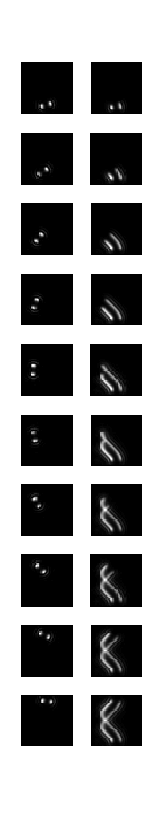

# STReM_source_code
This repository contains the STReM source code for a simple demonstration of 3D decomposition

Software:   Matlab 2009 or higher version

Run 'demo_cos.m' to 

(1). simulate a cosin shaped trajectory; 

  a.  The images in the left show the PSFs of emitters at different positions; 
      The images in the right show the cumulated images

  b.  The final captured image that is compressed with time information
  
  
(2). deconvolve the raw trajectory with 3D DH PSFs and overlay the recovered trajectory with raw image. 

