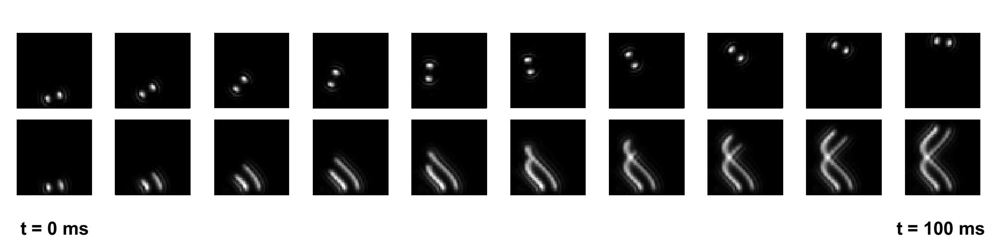
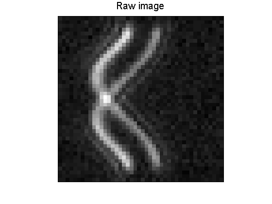
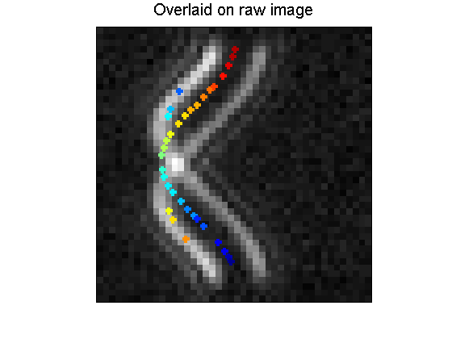

# STReM_source_code
This repository contains the STReM source code for a simple demonstration of 3D decomposition

Software:   Matlab 2009 or higher version

Run 
```
demo_cos.m
```
for a simple demo

# Simulate a cosin shaped trajectory 

1. The images in the left show the PSFs of emitters at different positions; 
      The images in the right show the cumulated images


2. The final captured image that is compressed with time information
  
  
# Deconvolve the raw trajectory with 3D DH PSFs

The results are overlaid the recovered trajectory with raw image. 


